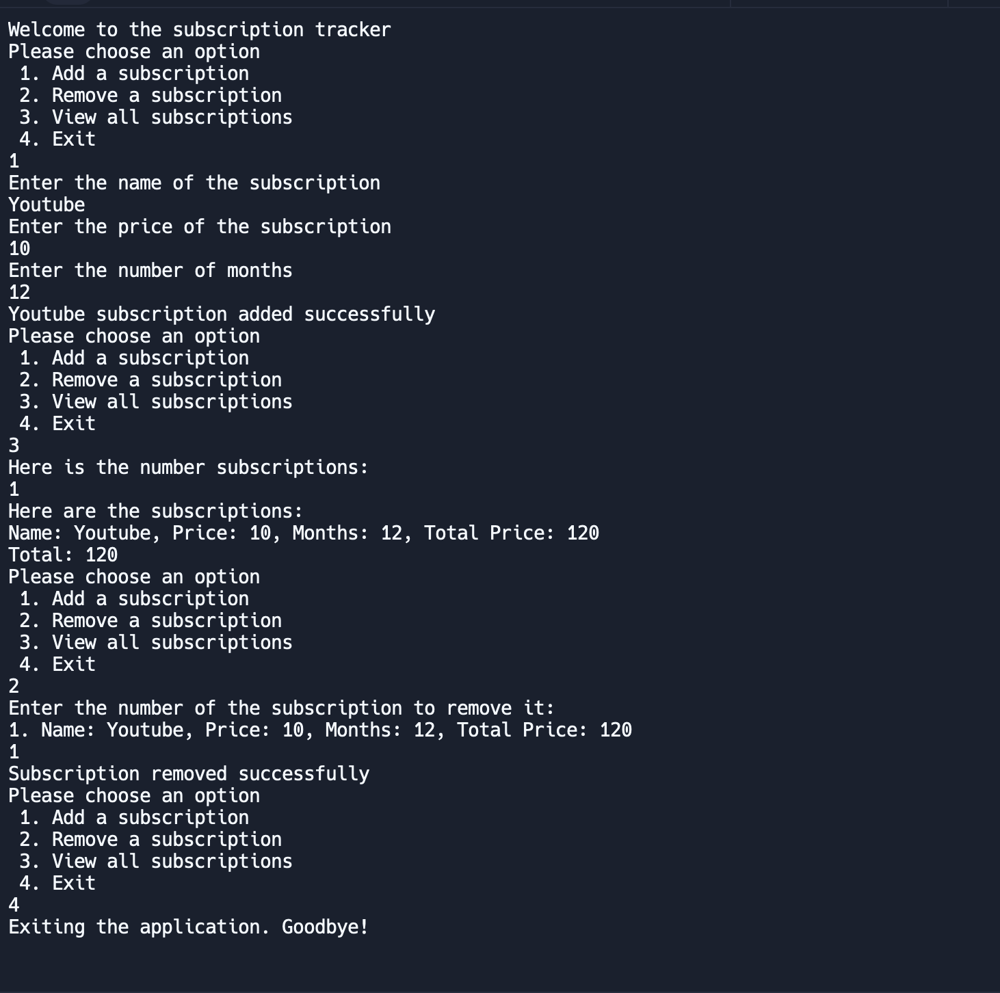

# Charles Madsen | AdvProgramming Portfolio | Email:9618055@graniteschools.org

## Individual Projects 

### Subscription Tracker Complex App #3 

This is a OOP that keeps tracks of Subscriptions that the user adds to the program, they can then view all their Subscriptions which tells them the name, price, months, totalp rice of the single Subscription, total price of all the Subscriptions, they can remove Subscriptions and then exit the program.

Demo  

[Source Code](src/Subscription-Tracker)

### JavaI/O
This is a program that takes in a txt called input.txt and it reads whatever was written in input.txt, after this it takes the words and Capitilizes them and outputs them onto Output.txt

Demo 

